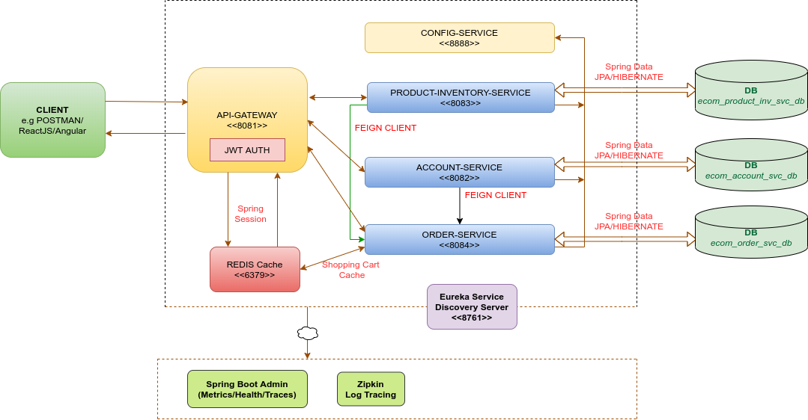

# Spring Boot Microservices Application for E-commerce
===================================================================================

> E-Commerce REST Microservices application.

- [Architecture](#architecture)
- [Prerequisites](#prerequisites)
- [Dependencies and Tools](#dependencies)
- [APIs](#apis)
- [CI/CD](#ci/cd)
- [Enhancements](#enhancements)
- [Contact](#contact)

### Architecture



### Prerequisites 

- **Redis Server**
- **Zipkin Server (default port)** : Start Zipkin server : ```java -jar zipkin.jar```

### Dependencies and Tools

- **Java 8**
- **Maven**
- **Spring Boot** - version 2.3.2 RELEASE
- **Spring Web MVC** - version 5.2.8 RELEASE
- **Spring SESSION** - version 2.3.0 RELEASE
- **Spring Cloud - Open Feign** - version 2.2.4 RELEASE
- **Spring Boot Admin** : version 2.3.2.RELEASE
- **Netflix Zuul** - version 2.2.4
- **Netflix Eureka Client/Server** - version 2.2.4
- **Netflix Ribbon** - version 2.2.4
- **Prometheus** : version 2.3.2.RELEASE
- **NOSQL Database engine** : Redis 6.0.6
- **Redis Client : JEDIS** - version 2.9.3
- **Spring Data REDIS** - version 2.3.2 RELEASE
- **Spring Data JPA** - version 2.3.2 RELEASE 
- **Hibernate** - version 5.4.18 Finale
- **SQL Database engine** : MySQL 

### APIs

1. **Signup :**

	- Sample request for creating user with `ROLE_SELLER`. There are total three roles `ROLE_ADMIN`, `ROLE_CUSTOMER` and `ROLE_SELLER`.

	``` 
	curl -X POST \
	  http://localhost:8081/signup \
	  -H 'Content-Type: application/json' \
	  -H 'Postman-Token: 8c11ed41-86f8-411b-bc90-8aa11aebd849' \
	  -H 'cache-control: no-cache' \
	  -d '{
	    "username": "seller1",
	    "password": "seller1",
	    "roles" : [{
	    	"id":3
	    }]
	}'
	```

2. **Signin :**

	- Sample request for sign-in

	``` 
	curl -X POST \
	  http://localhost:8081/signin \
	  -H 'Content-Type: application/json' \
	  -H 'Postman-Token: 75fa75f9-c86f-4076-8b7d-747b2cfa3515' \
	  -H 'cache-control: no-cache' \
	  -d '{
	    "username": "seller1",
	    "password": "seller1"
	}'
	```

	Response : [JWT Token](https://en.wikipedia.org/wiki/JSON_Web_Token) which we can set as a `Authorization` header in the next requests.

	```
	eyJhbGciOiJIUzI1NiJ9.eyJzdWIiOiJ1c2V...lqQ
	```
3. **Create Product :**

	- Sample request for creating a Product, user having role set 'ROLE_SELLER' can only allowed to create a product.

	```
	curl -X POST \
	http://localhost:8081/product-inventory-service/products \
	-H 'Authorization: eyJhbGciOiJIUzI1NiJ9.eyJzdWIiOiJhYmMiLCJhdXRoI...MjYwNzk1fQ.xS93Ps_V3s...txcIPw' \
	-H 'Content-Type: application/json' \
	-H 'Postman-Token: 49b7cb9d-b2d2-48f5-a0a4-a5732937ea6f' \
	-H 'cache-control: no-cache' \
	-d '{
	"productName" : "Oppo V10",
	"description" : "Oppo Selfi King" ,
	"price" : 15499.0,
	"category" : "mobile",
	"availability" : 15
	}'
	```

4. **Update Product Quantity :**

	- API to update the product quantity.

	```
	curl -X POST \
	'http://localhost:8081/product-inventory-service/products/2/quantity?quantity=4' \
	-H 'Authorization: eyJhbGciOiJIUzI1NiJ9.eyJzdWIiOiJ...iOjE1OTgyODI0MDh9.8gLz..zoV.gntSIO1exwm-3UDc' \
	-H 'Content-Type: application/json' \
	-H 'Postman-Token: ae8ed376-0d09-45e7-8aa8-6a56abb93ac4' \
	-H 'cache-control: no-cache' \
	-d '{
	"productName" : "Oppo V10",
	"description" : "Oppo Selfi King" ,
	"price" : 15499.0,
	"category" : "mobile",
	"availability" : 15
	}'
	```

5. **Get Product By Category :**

	- API to get product list by category
	
	```
	curl -X GET \
	'http://localhost:8081/product-inventory-service/products?category=headphones' \
	-H 'Authorization: eyJhbGciOiJIUzI1NiJ9.eyJzdWIiO..wIjoxNTk4MjcyNDI5fQ.SaEOf1..3DuIfhR.a8eeM1d0M5Q' \
	-H 'Content-Type: application/json' \
	-H 'Postman-Token: 1b498ace-f6a2-4ffb-8b24-30454ee68c27' \
	-H 'cache-control: no-cache'
	```

6. **Get Product By Name :**

	- API to get product list by product name
	
	```
	curl -X GET \
	'http://localhost:8081/product-inventory-service/products?name=Oppo%20V9' \
	-H 'Authorization: eyJhbGciOiJIUzI1NiJ9.eyJzdWIiO..5fQ.SaEOf1hOfcj3DuIfhRB_pwJ9fQ5v9JxPa8eeM1d0M5Q' \
	-H 'Content-Type: application/json' \
	-H 'Postman-Token: 8ddbc7be-b584-4268-884e-ac13f31c8507' \
	-H 'cache-control: no-cache'
	```

7. **Add Item To Cart :**

	- API to add item to Shopping Cart
	
	```
	curl -X POST \
	'http://localhost:8081/order-service/cart?productId=2&quantity=3' \
	-H 'Authorization: eyJhbGciOiJIUzI1NiJ9.eyJzdWIiOiJ1c2Vy..5ODI3OTcyMn0.VlhCmWS1N9Qt-qjKCbh57z4iSkZ-HYrUjkWpDpPmqXs' \
	-H 'Content-Type: application/json' \
	-H 'Postman-Token: 92c123f2-385b-4173-8029-bd0b8d1913ff' \
	-H 'cache-control: no-cache'
	```

8. **Remove Item from Cart :**

	- API sample to remove item from a shopping cart
	
	```
	curl -X DELETE \
	'http://localhost:8081/order-service/cart?productId=2' \
	-H 'Content-Type: application/json' \
	-H 'Cookie: 1' \
	-H 'Postman-Token: 50ed3234-048d-4838-aa26-33006c9c414b' \
	-H 'cache-control: no-cache'
	```

9. **Place Order :**
	
	- API to place an order

	```
	curl -X POST \
	http://localhost:8081/order-service/order/2 \
	-H 'Authorization: eyJhbGciOiJIUzI1NiJ9.eyJzdWIiOiJ1c2Vy...MjIsImV4cCI6MTU5ODI3OTcyMn0.VlhCm..z4iSkZ-HYrUjkWpDpPmqXs' \
	-H 'Content-Type: application/json' \
	-H 'Postman-Token: f5f7917e-df46-4f07-8f00-f303ffc1e3bb' \
	-H 'cache-control: no-cache'
	```

10. **Get Order By User ID:**
	
	- API to GET Orders for an order

	```
	curl -X GET \
	http://localhost:8081/order-service/order \
	-H 'Authorization: eyJhbGciOiJIUzI1NiJ9.eyJzdWIiOiJ0ZXN0IiwiY..MjcyNDI5fQ.SaEOf1hOfcj3DuIfhRB_pwJ9fQ5v9JxPa8eeM1d0M5Q' \
	-H 'Content-Type: application/json' \
	-H 'Postman-Token: 767aaefc-4ee3-4cc0-8806-a532ab1bc3d5' \
	-H 'cache-control: no-cache'
	```

### CI/CD
Kubernetes, Docker, Jenkins and etc.

### Enhancements
Deploy all these micro services in a service mesh environment like [Istio Service Mesh](https://istio.io/latest/docs/concepts/what-is-istio/)


